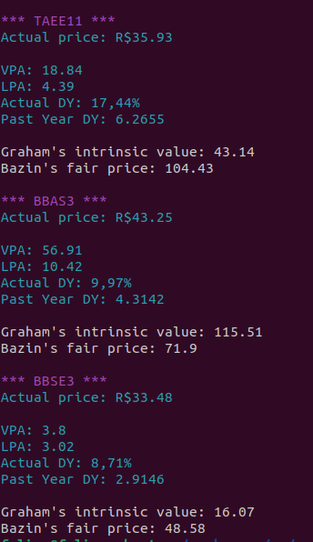

# go-valuation

This project calculates the fair price of stocks based on predetermined formulas
- Benjamin Graham formula
- Décio Bazin formula
- TODO others

Currently it only does this on BR stocks
It does a webscrapping to Status Invest (https://statusinvest.com.br), gets the indicators and make the calcs

# How to run
- Put the stocks in .txt file `/resources/input_stocks_br.txt`, one per line
- Run `go run .`

# Example
Put this 3 stocks in txt file (one per line):
 `TAEE11`
 `BBAS3`
 `BBSE3`

